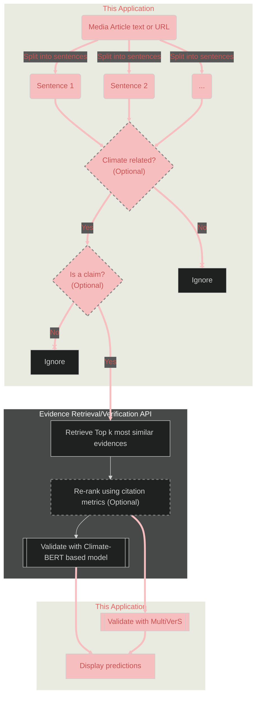
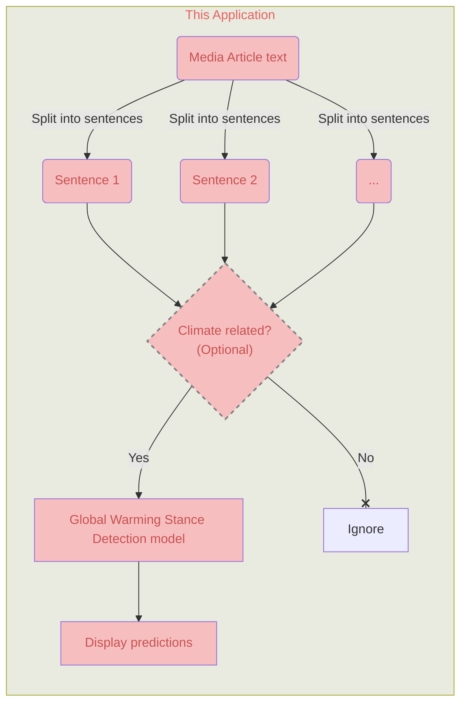

# Streamlit application for news articles Scientific verification and Global warming stance detection
This application and 
[the corresponding API](https://github.com/aaalexlit/cc-evidences-api/tree/main)
were created as an outcome of the 
[Detecting Bias in Climate Reporting in English and German Language News Media](https://omdena.com/projects/detecting-bias-in-climate-reporting-in-english-and-german-language-news-media/
) challenge by [Omdena](https://omdena.com/)

The ultimate goal of the challenge is to aid fighting misinformation 
in Climate Change-related articles across the internet.
The goal of the challenge is to create an AI-powered Bias detector for 
Climate Change related news articles.

This application attempts to detect two type of bias:
1. Scientific inaccuracy
2. Global Warming Stance

## General workflow

### Scientific verification

### Global Warming Stance detection

## Components

### Split into sentences
[Spacy "en_core_web_sm" pipeline](https://spacy.io/models/en#en_core_web_sm)
is used for text segmentation task  
This model is the smallest and the fastest and according to spacy's 
[Accuracy Evaluation](https://spacy.io/models/en#en_core_web_sm-accuracy) has
the same metric values as the bigger CPU-optimized models

### Classify as Climate-related (Optional)

## Discussion and next steps
Please refer to the [Discussion](doc/discussion.md)

## Local development and deployment
Please refer to the [Technical documentation](doc/tech.md)