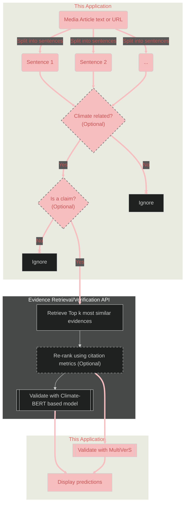
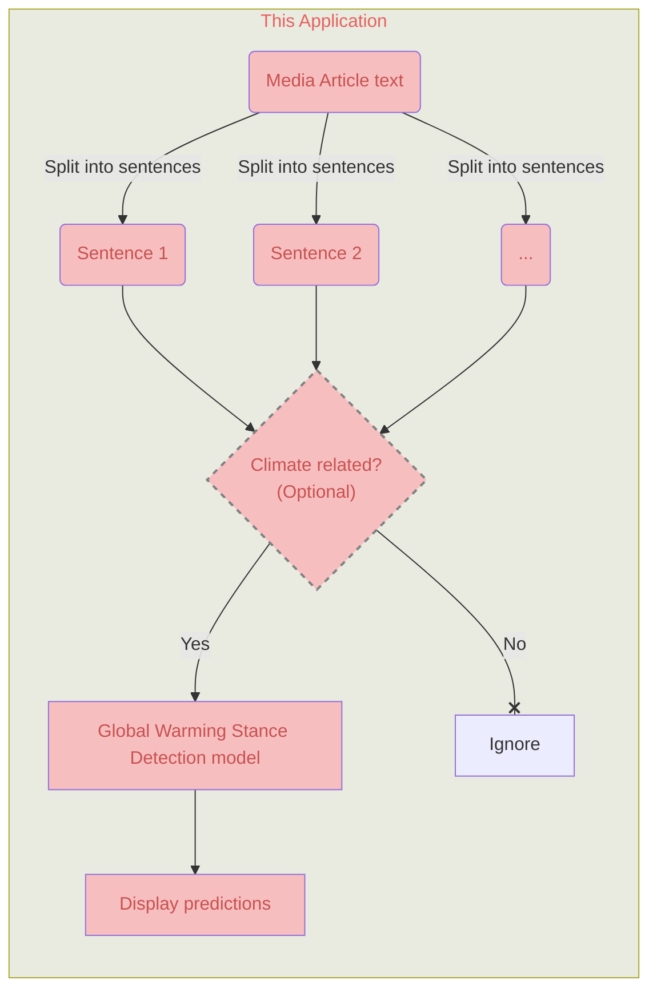

# Streamlit application for news articles Scientific verification and Global warming stance detection
This application and 
[the corresponding API](https://github.com/aaalexlit/cc-evidences-api/tree/main)
were created as an outcome of the 
[Detecting Bias in Climate Reporting in English and German Language News Media](https://omdena.com/projects/detecting-bias-in-climate-reporting-in-english-and-german-language-news-media/
) challenge by [Omdena](https://omdena.com/)

The ultimate goal of the challenge is to aid fighting misinformation 
in Climate Change-related articles across the internet.
The goal of the challenge is to create an AI-powered Bias detector for 
Climate Change related news articles.

This application attempts to detect two type of bias:
1. Scientific inaccuracy
2. Global Warming Stance

It's not meant to replace experts but rather aid them
with automation of some tasks like evidence retrieval
or claim/climate-related text detection in a bigger corpus

Another potential use of this tool is to facilitate creation
of new climate change related fact-checking datasets as for now the unique
dataset available in the climate change domain is 
[CLIMATE-FEVER](https://www.sustainablefinance.uzh.ch/en/research/climate-fever.html)
dataset [[3]](#references) that features sentence granularity and uses
Wikipedia as its source

## General workflow

### Scientific verification

### Global Warming Stance detection

## Components

### Split into sentences
[Spacy "en_core_web_sm" pipeline](https://spacy.io/models/en#en_core_web_sm)
is used for text segmentation task  
This model is the smallest and the fastest and according to spacy's 
[Accuracy Evaluation](https://spacy.io/models/en#en_core_web_sm-accuracy) has
the same metric values as the bigger CPU-optimized models

### Classify as Climate-related (Optional)

There's a check in the beginning of the pipeline if the entered
text is related to climate topics. It has only informative purpose
and even a text classified as not climate related can be analyzed further
(but probably there's not much sense in continuing anyway).
The reason to keep it this way is that the prediction is not 100% correct and
sometimes some text about climate can be classified as not related.

On a later stage there's an option to filter and analyse only sentences that
are classified as related to climate.

In both cases the same [model](https://huggingface.co/kruthof/climateattention-10k-upscaled) 
is used to perform the classification
It is a ClimateBERT [[1]](#references) based classifier fine-tuned on the
ClimaText dataset [[2]](#references) and is 
[recommended by the model authors](https://huggingface.co/kruthof/climateattention-ctw)
for company disclosures or news article analysis

## Discussion and next steps
Please refer to the [Discussion](doc/discussion.md)

## Local development and deployment
Please refer to the [Technical documentation](doc/tech.md)

## References
1. Webersinke, N., Kraus, M., Bingler, J. A., & Leippold, M. (2021). Climatebert: 
A pretrained language model for climate-related text. arXiv preprint arXiv:2110.12010.
2. Varini, F. S., Boyd-Graber, J., Ciaramita, M., & Leippold, M. (2020). ClimaText: 
A dataset for climate change topic detection. arXiv preprint arXiv:2012.00483.
3. Diggelmann, Thomas; Boyd-Graber, Jordan; Bulian, Jannis; Ciaramita, Massimiliano; 
Leippold, Markus (2020). CLIMATE-FEVER: A Dataset for Verification of Real-World Climate 
Claims. In: Tackling Climate Change with Machine Learning workshop at NeurIPS 2020, Online, 
11 December 2020 - 11 December 2020.