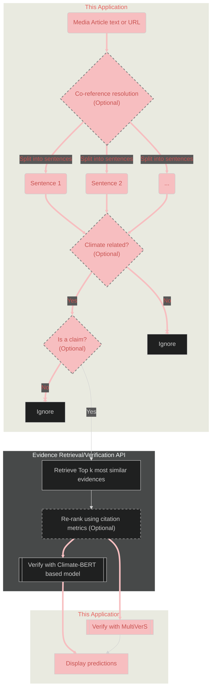
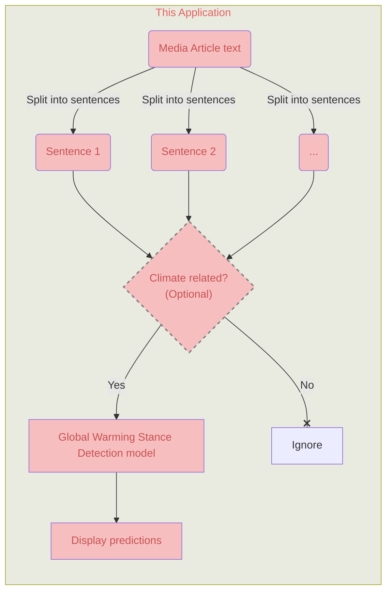

# Streamlit application for news articles Scientific verification and Global warming stance detection
This application and 
[the corresponding API](https://github.com/aaalexlit/cc-evidences-api/tree/main)
were created as an outcome of the 
[Detecting Bias in Climate Reporting in English and German Language News Media](https://omdena.com/projects/detecting-bias-in-climate-reporting-in-english-and-german-language-news-media/
) challenge by [Omdena](https://omdena.com/)

The ultimate goal of the challenge is to aid fighting misinformation 
in Climate Change-related articles across the internet.
The goal of the challenge is to create an AI-powered Bias detector for 
Climate Change related news articles.

This application attempts to detect two type of bias:
1. Scientific inaccuracy
2. Global Warming Stance

It's not meant to replace experts but rather aid them
with automation of some tasks like evidence retrieval
or claim/climate-related text detection in a bigger corpus

Another potential use of this tool is to facilitate creation
of new climate change related fact-checking datasets as for now the unique
dataset available in the climate change domain is 
[CLIMATE-FEVER](https://www.sustainablefinance.uzh.ch/en/research/climate-fever.html)
dataset [[3]](#references) that features sentence granularity and uses
Wikipedia as its source

## General workflow

### Scientific verification

### Global Warming Stance detection

## Components

### Split into sentences
[Spacy "en_core_web_sm" pipeline](https://spacy.io/models/en#en_core_web_sm)
is used for text segmentation task  
This model is the smallest and the fastest and according to spacy's 
[Accuracy Evaluation](https://spacy.io/models/en#en_core_web_sm-accuracy) has
the same metric values as the bigger CPU-optimized models

### Classify as Climate-related (Optional)

There's a check in the beginning of the pipeline if the entered
text is related to climate topics. It has only informative purpose
and even a text classified as not climate related can be analyzed further
(but probably there's not much sense in continuing anyway).
The reason to keep it this way is that the prediction is not 100% correct and
sometimes some text about climate can be classified as not related.

On a later stage there's an option to filter and analyse only sentences that
are classified as related to climate.

In both cases the same [model](https://huggingface.co/kruthof/climateattention-10k-upscaled) 
is used to perform the classification
It is a ClimateBERT [[1]](#references) based classifier fine-tuned on the
ClimaText dataset [[2]](#references) and is 
[recommended by the model authors](https://huggingface.co/kruthof/climateattention-ctw)
for company disclosures or news article analysis

### Claim detection

:x: First we attempted to use ClimateBERT-based model fine-tuned on ["ClimateBERT Text 
classification dataset"](https://huggingface.co/datasets/climatebert/environmental_claims) 
[[1]](#references) referred to as 
[environmental-claims model](https://huggingface.co/climatebert/environmental-claims) 
available from huggingface

nature of the dataset doesn't seem to work well for 
our general purpose (ie working with media articles on the internet) since
it represents 
> sentences extracted from corporate annual reports, sustainability 
> reports and earning calls transcripts

:white_check_mark: We end up using 
[ClaimBuster-DeBERTaV2 model](https://huggingface.co/whispAI/ClaimBuster-DeBERTaV2)
from huggingface is used to classify a sentence as claim/not claim.
It's a classifier trained on [ClaimBuster dataset](https://zenodo.org/record/3609356#.ZEVK4OxBxhG)
that predicts a phrase to be one of:
- Non-Factual Statement (NFS)
- Unimportant Factual Statement (UFS)
- Check-worthy Factual Statement (CFS)

The performance is far from ideal partly 
for the reasons discussed [here](doc/discussion.md#claim-detection)

## Scientific claim verification
Scientific claim verification task requires an NLP system to label scientific
documents which SUPPORT or REFUTE an input claim and to select evidentiary 
sentences (rationales) justifying each predicted label [[4]](#references)  

Two different approaches are currently available

### ClimateBERT-based classifier fine-tuned on CLIMATE-FEVER

With this approach 
1. k most relevant to a given claim sentences from scientific
article abstracts (evidences) get retrieved
2. and then the claim-evidence pair is passed to the model that classifies it 
as SUPPORTS, REFUTES or NOT_ENOUGH_INFO.

The classifier model is
[Climatebert-fact-checking model](https://huggingface.co/amandakonet/climatebert-fact-checking) 
available from huggingface.
It's a ClimateBERT [[1]](#references) model fine-tuned 
on [CLIMATE-FEVER](https://www.sustainablefinance.uzh.ch/en/research/climate-fever.html)
dataset 
[[3]](#references)

After trying it in the wild we realized that it gives pretty modest results
on the real-world data.  
The main problem of this approach is that the text divided into phrases the context needed to 
make a correct prediction gets lost. This problem can be to some limited extent 
solved by [co-reference resolution](#co-reference-resolution) of the input text.

But to definitely solve it some other approach needs to be used, and that's where 
MultiVerS comes in

### :star_struck: MultiVerS (Multitask Verification fro Science) model

MultiVerS predicts a fact-checking label and identifies rationales in 
a multitask fashion based on a shared encoding of the claim and full document 
context.
All the MultiVerS models from the original publication [[4]](#references)  
are trained and fine-tuned on the 
out-of-domain data (FEVER dataset + mostly biomedical scientific articles)

For the purposes of this project MultiVerS model was fine-tuned on the modified
CLIMATE-FEVER dataset.

## Fine-tuning MultiVerS Model on CLIMATE-FEVER dataset

1. **Modify CLIMATE-FEVER** combining the evidence sentences into pseudo-abstracts 
by grouping the ones that come from the same Wikipedia article.   
The resulting dataset is a slightly shortened version of CLIMATE-FEVER. The cutoff 
was needed to overcome the fact that Wikipedia articles are much longer than
scientific paper abstracts  
All the modification code can be found 
in [this repo](https://github.com/aaalexlit/convert-CF-to-multivers)
2. **Fine-tune**.  
[Pre-trained Multivers model](https://github.com/dwadden/multivers/blob/main/doc/training.md#multivers-model-training)
was used as a base for fine-tuning.  
I used the code shared by the MultiVerS paper authors, replacing their dataset for fine-tuning
   with the one obtained on the previous step.
I was switching back and forth between Google Colab stopping the 
training and resuming it from the last checkpoint to leverage 
free GPU. All-in-all it took several days to perform.
Here are the links to the notebooks used
   1. [Colab Notebook](https://github.com/aaalexlit/omdena_climate_change_challenge_notebooks/blob/main/finetune_multivers_on_climate_fever.ipynb)
   2. [Kaggle Notebook](https://github.com/aaalexlit/kaggle-notebooks/blob/main/finetune-multivers-on-climate-fever-kaggle.ipynb)

Currently, the model checkpoint that has **the best rationale classification score** is used
in the application.

### Potential improvements
The provided fine-tuning code isn't set up to enable "pausing" and continuing
training from a saved checkpoint, it's supposed to be run in one go.
Later I realized that re-starting the fine-tuning might mess up 
with the LR-scheduler making it start from the initial learning rate value.

## Advanced Options General

### Evidence re-ranking
Discussed in detail 
[in the API documentation](https://github.com/aaalexlit/cc-evidences-api/tree/main#evidence-re-ranking)

### Co-reference resolution
By dividing an abstract into separate phrases, the context gets lost
To try to partly solve this problem co-reference resolution 
is offered as an option. But of course it has quite limited performance in 
this regard.  
[Fastcoref library](https://pypi.org/project/fastcoref/) along with spaCy 
is used to perform this task

### Top evidence number to retrieve

### Evidence similarity threshold

## Advanced Options ClimateBERT-based model 

### Include title during verification
If turned on, abstract title is concatenated with the relevant phrase from
the abstract and this combined evidence phrase is passed along with the claim to 
the ClimateBERT-based classifier. This option is an attempt to give the 
verification model more context.

### Retrieve evidence abstracts
If selected 

### Show NEI (NOT ENOUGH INFORMATION)
By default, only evidences predicted to be supporting or refuting are displayed
With this option on the neutral (NOT ENOUGH INFORMATION) evidences are also
displayed.
It's a way to get all the relevant evidence retrieved

## Discussion and next steps
Please refer to the [Discussion](doc/discussion.md)

## Local development and deployment
Please refer to the [Technical documentation](doc/tech.md)

## References
1. Webersinke, N., Kraus, M., Bingler, J. A., & Leippold, M. (2021). Climatebert: 
A pretrained language model for climate-related text. arXiv preprint arXiv:2110.12010.
2. Varini, F. S., Boyd-Graber, J., Ciaramita, M., & Leippold, M. (2020). ClimaText: 
A dataset for climate change topic detection. arXiv preprint arXiv:2012.00483.
3. Diggelmann, Thomas; Boyd-Graber, Jordan; Bulian, Jannis; Ciaramita, Massimiliano; 
Leippold, Markus (2020). CLIMATE-FEVER: A Dataset for Verification of Real-World Climate 
Claims. In: Tackling Climate Change with Machine Learning workshop at NeurIPS 2020, Online, 
11 December 2020 - 11 December 2020.
4. Wadden, D., Lo, K., Wang, L.L., Cohan, A., Beltagy, I., & Hajishirzi, H. (2021). 
MultiVerS: Improving scientific claim verification with weak supervision and full-document 
context. NAACL-HLT.